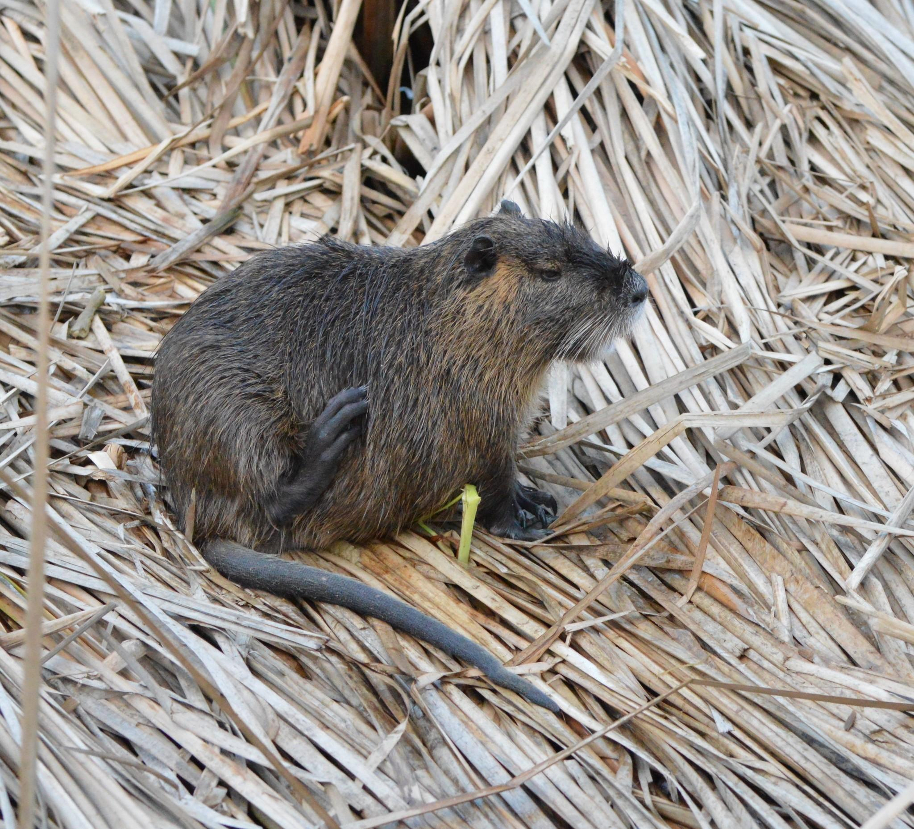

# Approach Demo 
In the folder [images](/demo/images/) you can find a couple of images. For these images, we show here exemplary how we calculated the accuracy for the different computer vision models. 

Typically, for a given image, the models return species as a prediction, including the probability that the species depicted on the image actually matches the prediction. Thereby, it differs by model how many predictions are returned. To determine the accuracy of the models, we decided to calculate the Top-1 and Top-5 accuracy. If the first prediction of a model is correct, it is a Top-1 prediction and if one of the first five predictions of a model is correct, it is within the Top-5 predictions. The calculation of the Top-5 accuracies can be interesting to decide if the model is helpful to show citizens 5 predictions from which they can indicate the observed one. Thus, the percentage given by the Top-1 or Top-5 accuracy indicates for how many of the images contained in the test dataset the prediction was correct or within the Top-5, respectively. 

The rank indicates which of the first five predictions by the model was correct. 
If 'n/a' is entered as a value in the tables below, no prediction was returned by the model or, with respect to the rank, no correct prediction among the first 5 predictions was returned by the respective model. 

## iNat2021 
Image                                                                       | Prediction    | Propability  | Rank
:-----                                                                      | :----:        | -----:            | -----:
           | **Myocastor coypus**   Ondatra zibethicus   Castor canadensis   Lontra canadensis   Microtus pennsylvanicus           | 0.81   0.08   0.06   0.01   0.01 | 1
          | Asclepias speciosa   **Asclepias syriaca**   Asclepias eriocarpa   Wyethia mollis   Calotropis procera     | 0.50   0.41   0.03   0.01   0.01 | 2
    | Terrapene ornata   Caiman crocodilus   Apalone spinifera   Stigmochelys pardalis    Lithobates septentrionalis       | 0.18   0.13   0.09   0.07   0.06 | n/a

The correct prediction is written in bold. The accuracies calculated with the examples in the table are: Top-1 accuracy: 33.33 % (1 out of 3 correct in the first prediction), Top-5 accuracy: 66.67 % (2 out of 3 correct in the first five predictions). The species depicted in the last example is Lithobates catesbeianus. 

## iNaturalist API
Image                                                                       | Prediction    | Propability  | Rank
:-----                                                                      | :----:        | -----:            | -----:
           | **Myocastor coypus**   Hydromys chrysogaster   Marmota flaviventris   Cercopithecus mitis   Lontra canadensis           | n/a   n/a   n/a   n/a   n/a | 1
          | **Asclepias syriaca**   Asclepias speciosa   Asclepias sullivantii   Cunonia capensis   Asclepias glaucescens       | n/a   n/a   n/a   n/a   n/a | 1
    | Lithobates montezumae   Pelophylax bedriagae   Pelophylax ridibundus    Pelophylax perezi    Rana draytonii        | n/a   n/a   n/a   n/a   n/a | n/a

The correct prediction is written in bold. The accuracies calculated with the examples in the table are: Top-1 accuracy: 66.67 % (2 out of 3 correct in the first prediction), Top-5 accuracy: 66.67 % (2 out of 3 correct in the first five predictions). The species depicted in the last example is Lithobates catesbeianus. For the predictions by iNaturalist no propability was delivered. 

## Microsoft Species Classification
Image                                                                       | Prediction    | Propability  | Rank
:-----                                                                      | :----:        | -----:            | -----:
           | **Myocastor coypus**   Castor canadensis   Ondatra zibethicus   Hydrochoerus hydrochaeris   Lontra canadensis           | 0.873   0.04   0.007   0.005   0.003 | 1
          | **Asclepias syriaca**   Asclepias speciosa   Asclepias eriocarpa   Asclepias viridiflora   Asclepias linaria       | 0.582   0.305   0.026   0.008   0.006 | 1
    | **Lithobates catesbeianus**   Lithobates berlandieri   Lithobates clamitans    Rana temporaria    Rana draytonii       | 0.835   0.025   0.024   0.015   0.015 | 1

The correct prediction is written in bold. The accuracies calculated with the examples in the table are: Top-1 accuracy: 100 % (3 out of 3 correct in the first prediction), Top-5 accuracy: 100 % (3 out of 3 correct in the first five predictions).

## Nature Identification API (NIA) 
Image                                                                       | Prediction    | Propability  | Rank
:-----                                                                      | :----:        | -----:            | -----:
           | **Myocastor coypus**   Ondatra zibethicus   Sus scrofa   Castor fiber   Phoca vitulina           | 0.9998825788   6,88E+10   2,10E+10   1,48E+11   3,90E+09 | 1
          | **Asclepias syriaca**   Hyla arborea   Cydalima perspectalis   Caloptilia stigmatella   Smerinthus ocellatus       | 0.3324504793   0.2853876054   0.03728974983   0.03603673354   0.03525354341 | 1
    | Pelophylax spec.   Rana temporaria   Pelophylax lessonae    Pelophylax ridibundus    Pelophylax kl. esculentus       | 0.613794446   0.1141380891   0.06552799046   0.0512454994   0.03507460654 | n/a

The correct prediction is written in bold. The accuracies calculated with the examples in the table are: Top-1 accuracy: 66.67 % (2 out of 3 correct in the first prediction), Top-5 accuracy: 66.67 % (2 out of 3 correct in the first five predictions). The species depicted in the last example is Lithobates catesbeianus. 

## Pl@ntNet-API
Image                                                                       | Prediction    | Propability   | Rank
:-----                                                                      | :----:        | -----:            | -----:
           | **Gunnera tinctoria**   n/a   n/a   n/a   n/a          | 0.25288   n/a   n/a   n/a   n/a | 1
          | **Asclepias syriaca**   Asclepias speciosa   Asclepias latifolia   Asclepias vestita   Asclepias erosa       | 0.4268   0.39717   0.03072   0.0272   0.01281 | 1
    | **Ludwigia grandiflora**   Ludwigia peploides   n/a    n/a    n/a       | 0.87854   0.11198   n/a   n/a   n/a | 1

The correct prediction is written in bold. The accuracies calculated with the examples in the table are: Top-1 accuracy: 100 % (3 out of 3 correct in the first prediction), Top-5 accuracy: 100 % (3 out of 3 correct in the first five predictions). 

## Plant.id API
Image                                                                       | Prediction    | Propability  | Rank
:-----                                                                      | :----:        | -----:            | -----:
           | **Gunnera tinctoria**   Gunnera   Gunnera manicata   Rheum   Heracleum sphondylium           | 0.6391498247   0.1985945135   0.05868734624   0.0165985485   0.01614800067 | 1
          | **Asclepias syriaca**   Asclepias speciosa   n/a   n/a   n/a       | 0.9480034621   0.03453290734   n/a   n/a   n/a | 1
    | **Ludwigia grandiflora**   Ludwigia peploides   Ludwigia octovalvis   n/a    n/a       | 0.8573716058   0.09132727917   0.01041655874   n/a   n/a | 1

The correct prediction is written in bold. The accuracies calculated with the examples in the table are: Top-1 accuracy: 100 % (3 out of 3 correct in the first prediction), Top-5 accuracy: 100 % (3 out of 3 correct in the first five predictions). 

